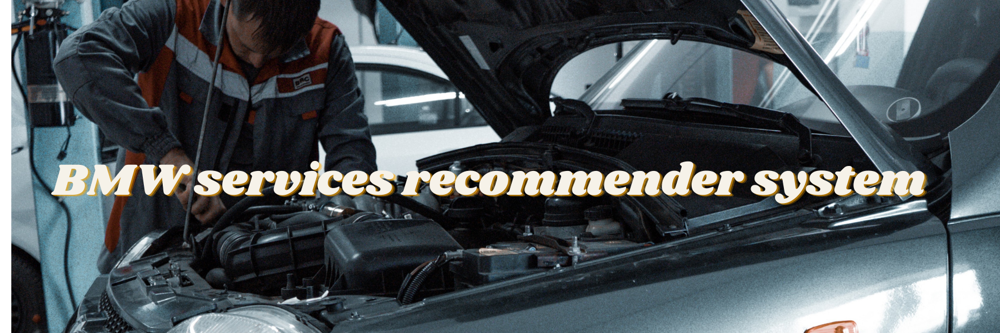
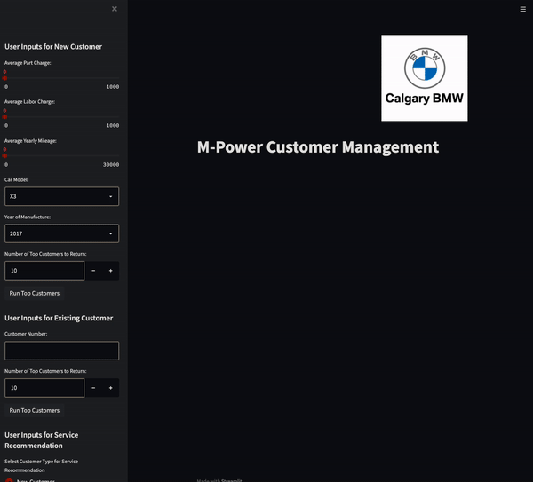

[](https://github.com/ellerbrock/open-source-badges/)


Badge [source](https://shields.io/)


## Authors

- [@semasuka](https://www.github.com/semasuka)
- [@Roni Konrad](https://github.com/RoniKonrad)
- Kevin Luc

## Table of Contents

- [Business problem](#business-problem)
- [Data source](#data-source)
- [Methods](#methods)
- [Tech Stack](#tech-stack)
- [Quick glance at the results](#quick-glance-at-the-results)
- [Lessons learned and recommendation](#lessons-learned-and-recommendation)
- [Limitation and what can be improved](#limitation-and-what-can-be-improved)
- [Run Locally](#run-locally)
- [App deployed on Heroku](#app-deployed-on-heroku)
- [Repository structure](#repository-structure)
- [Contribution](#contribution)
- [License](#license)


## Business problem

This application is for up selling services for BMW’s customers who have bought a car at the dealership. These campaigns are targeted to clients who have similar characteristics (same model, average part and labour charge) and who are most likely to be up sold services.
## Data source

Real data from the BMW dealership Calgary. The data is obfuscated (personal information have been removed, hidden or encrypted)
## Methods

- Exploratory data analysis
- Feature engineering
- Feature encoding
- Feature transformation
- Model deployment
## Tech Stack

- Python (refer to requirement.txt for the packages used in this project)
- Streamlit (interface for the model)


## Quick glance at the results

The results from the two models are promising. For the first model, the recommender system was able to come up with the ID of clients that were similar using content-based filtering. We can filter the top 10 or 100, similar customers.

To test our result, we used a random customer ID and compared it with the first similar customer from our model 1. The two clients had the same model with similar mileage and average labour and part charges. We did the same test on model 2 and only kept the top two services frequently bought together.


## Lessons learned and recommendation

One lesson learned is how a recommender system works in general, how to preprocess the data for a recommender system is different than how you would process the data for a classification or regression problem.

## Limitation and what can be improved

The app can be improved by adding more recent data to the system, especially new data that include new BMW models coming out (model 2021 onward). A constant update of the dataset is mandatory for effective results over the years.


## Run Locally
Initialize git

```bash
git init
```


Clone the project

```bash
git clone https://github.com/semasuka/SAITPROJ.git
```

enter the project directory

```bash
cd SAITPROJ
```

Create a conda virtual environment and install all the packages from the requirements.txt file

```bash
conda env create --prefix <env_name> --file requirements.txt
```

Activate the conda environment

```bash
conda activate <env_name>
```

List all the packages installed

```bash
conda list
```

Start the streamlit server locally

```bash
streamlit run bmw_stream.py
```
If you are having issue with streamlit, please follow [this tutorial on how to set up streamlit](https://docs.streamlit.io/library/get-started/installation)

## App deployed on Heroku



Video to gif [tool](https://ezgif.com/)
## Repository structure


```

├── assets
│   ├── Bmw_recsys.png              <- Image used as the banner in this README.
│   ├── gif_streamlit.gif           <- gif file used in this README.
│   ├── Logo.png                    <- BMW logo image used in the streamlit interface.
│
│
├── datasets
│   ├── Aggregated Data.csv         <- original dataset.
│   ├── Ready_Data.csv              <- preprocessed dataset used for the recommender system.
│
│
├── bwm_stream.py                   <- main app file with the recommender system and the streamlit interface.
│
│
├── LICENSE                         <- license file.
│
│
├── Procfile                        <- streamlit file used by Heroku to deploy the app.
│
│
├── README.md                       <- this readme file.
│
│
├── requirements.txt                <- list of all the dependencies with their versions(used by Streamlit & Heroku).
│
│
├── runtime.txt                     <- file used to specify which Python version(used by Streamlit).
│
│
├── setup.sh                        <- streamlit file used by Heroku to deploy the app.

```
## Contribution

Pull requests are welcome!

## License

MIT License

Copyright (c) 2022 M-power team

Permission is hereby granted, free of charge, to any person obtaining a copy
of this software and associated documentation files (the "Software"), to deal
in the Software without restriction, including without limitation the rights
to use, copy, modify, merge, publish, distribute, sublicense, and/or sell
copies of the Software, and to permit persons to whom the Software is
furnished to do so, subject to the following conditions:

The above copyright notice and this permission notice shall be included in all
copies or substantial portions of the Software.

THE SOFTWARE IS PROVIDED "AS IS", WITHOUT WARRANTY OF ANY KIND, EXPRESS OR
IMPLIED, INCLUDING BUT NOT LIMITED TO THE WARRANTIES OF MERCHANTABILITY,
FITNESS FOR A PARTICULAR PURPOSE AND NONINFRINGEMENT. IN NO EVENT SHALL THE
AUTHORS OR COPYRIGHT HOLDERS BE LIABLE FOR ANY CLAIM, DAMAGES OR OTHER
LIABILITY, WHETHER IN AN ACTION OF CONTRACT, TORT OR OTHERWISE, ARISING FROM,
OUT OF OR IN CONNECTION WITH THE SOFTWARE OR THE USE OR OTHER DEALINGS IN THE
SOFTWARE.

Learn more about [MIT](https://choosealicense.com/licenses/mit/) license
